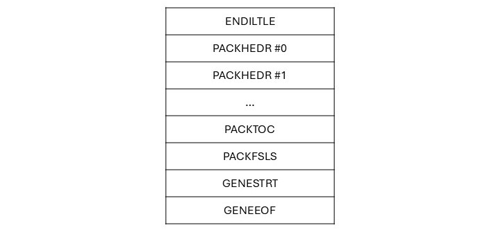

---

# 소개

[010 Editor](https://www.sweetscape.com/010editor/) 전용 *.apk 파일 및 *.idx 파일을 구조를 쉽게 볼 수 있게 해주는 템플릿입니다.

apk 파일과 idx 파일은 일부 콘솔 게임 등에서 발견되는 포맷입니다.

* apk 파일은 각종 파일들을 포함하고 있는 아카이브 형식의 파일입니다.
* idx 파일은 apk 파일과 같이 존재하며 apk 파일에 포함된 파일의 인덱스 정보만 포함합니다.

파일 포맷에 대한 보다 자세한 분석은 [ymtools](https://github.com/akio7624/ymtools) 레포지토리를 참고해주세요. 

또한, 이 ymtools를 이용하여 apk 파일 및 idx 파일을 제한적으로 편집할 수 있습니다.

# 사용 방법
1. *.bt 파일을 다운로드 받은 후 적당한 곳에 저장합니다.
    * `APK.bt` 파일은 *.apk 파일 전용 템플릿입니다
    * `IDX.bt` 파일은 *.idx 파일 전용 템플릿입니다
    * `APK-nolib.bt` 파일은 DLL 라이브러리 없이 실행 가능한 *.apk 파일 전용 템플릿입니다
2. (Windows만 해당) `LibApkIdxTemplate.dll` 파일을 템플릿 파일과 같은 폴더에 위치해주세요.
3. 010 Editor로 분석을 원하는 파일을 엽니다.
4. `Templates > Open Template...`으로 파일에 맞는 템플릿 파일을 선택합니다.
5. 템플릿 파일 창이 열리면 F5를 눌러 템플릿을 실행합니다.
6. `Variables` 탭에서 분석된 파일의 구조를 쉽게 볼 수 있습니다.

# 오류
## Check the file is a valid ??-bit library.
`Check the file is a valid ??-bit library.` 오류가 발생하는 경우 dll 파일과 Windows의 아키텍처가 일치하지 않아 발생할 수 있습니다.
자신의 컴퓨터가 32비트라면 x86 폴더의 파일을, 64비트라면 x64 폴더의 dll 파일을 사용하세요.

##  Could not locate file to link.
`Could not locate file to link.` 오류가 발생하는 경우 dll 파일의 이름이 `LibApkIdxTemdplate.dll`가 맞는지 확인해주세요.

현재 라이브러리는 Windows만 지원하므로 리눅스 등에서 실행하는 경우 `APK.bt` 대신 `APK-nolib.bt` 파일을 사용해주세요.
파일명을 추가적으로 표시해주는 기능의 존재 여부의 차이일 뿐, 파일 분석에는 지장없습니다.
* IDX.bt 템플릿 실행에는 추가적인 파일이 필요 없습니다.

---

구조 분석 업데이트: 2024-11-01

# APK 파일의 내부 구조
이제부터 APK 파일의 내부 구조에 대해 상세히 설명하겠다.
모든 자료는 이미 분석된 일부 자료와 각종 분석을 통하여 밝혀진 것으로, 공식이 아니므로 100% 확실한 내용은 아니다.

여기서 소개한 각 영역의 명칭은 모두 공식 명칭이 아니라 필자가 임의로 지정한 것이다. 이 파일의 구조는 공식적으로 공개된 적이 없다.

기본적으로 위 이미지와 같은 구조로 이루어져 있다. APK 파일은 파일들을 보관하기 위한 아카이브 타입의 파일이다.

파일의 앞 부분에는 담고 있는 파일들의 오프셋, 사이즈, 이름 등의 정보를 가지고 있고, 파일의 뒤쪽에 실제 파일 데이터들이 나열된다.

또한 아카이브라는 개념도 존재하는데, 아카이브 각각이 파일을 담을 수 있다. 정확한 비유는 아니지만 폴더 정도의 개념으로 이해해두자.

## ENDILTLE 테이블
|     명칭     |  자료형   | 크기 | 설명                                                                                            |
|:----------:|:------:|:--:|:----------------------------------------------------------------------------------------------|
| ENDIANESS  | char[] | 8  | `ENDILTLE`이라면 파일의 모든 필드는 리틀 엔디언으로 읽는다. 빅 엔디언이라면 `ENDIBIGE`이 될 것으로 예상되지만, 현재 그런 파일은 발견하지 못했다. |
|  PADDING   | byte[] | 8  | 테이블의 전체 크기가 16바이트로 나누어 떨어지도록 하기 위한 0 패딩. `ENDIANESS`가 항상 8글자이므로 패딩도 항상 8바이트이다.               |

## PACKHEDR 테이블
|          명칭          |  자료형   | 크기 | 설명                                                                                                     |
|:--------------------:|:------:|:--:|:-------------------------------------------------------------------------------------------------------|
|      SIGNATURE       | char[] | 8  | 테이블의 시그니처 바이트. 항상 `PACKHEDR`이다.                                                                        |
|      TABLE SIZE      | uint64 | 8  | 테이블의 첫 16바이트를 제외한 테이블의 크기.                                                                             |
|      unknown 1       |   -    | 8  | 알 수 없는 영역. 여러 파일에서 `00 00 01 00 00 00 00 00`이 공통으로 보인다.                                             |
|   FILE LIST OFFSET   | uint32 | 4  | 실제 파일의 나열이 시작되는 지점의 오프셋.                                                                               |
| ARCHIVE PADDING TYPE | uint32 | 4  | 아카이브 패딩 시 블록 크기를 지정하는 것으로 추정. `1 (0x0001)`: 2048로 나누어 떨어지도록 패딩. `2 (0x0002)`: 512로 나누어 떨어지도록 패딩. |
|         HASH         | byte[] | 16 | 파일의 MD5 해시 체크섬인 것이 거의 확실해 보이나, 실제로 어느 영역을 해싱한 것인지는 아직 알아내지 못했다.                                        |

테이블의 크기가 16으로 나눠 떨어지므로 테이블에 대해 추가적인 패딩은 없다.

## PACKTOC 테이블
|        명칭        |      자료형      |      크기       | 설명                                                                          |
|:----------------:|:-------------:|:-------------:|:----------------------------------------------------------------------------|
|    SIGNATURE     |    char[]     |       8       | 테이블의 시그니처 바이트. 항상 `PACKTOC `이다. 마지막에 공백(0x20)이 존재함에 주의.                  |
|    TABLE SIZE    |    uint64     |       8       | 테이블의 첫 16바이트를 제외한 테이블의 크기.                                                  |
|   TOC SEG SIZE   |    uint32     |       4       | `TOC SEGMENT` 한 개의 크기. 다만 이 세그먼트의 구조가 일정한 것 같으므로, 값은 `40`으로 고정일 것으로 예상함. |
|  TOC SEG COUNT   |    uint32     |       4       | `TOC SEGMENT`의 총 개수.                                                        |
|    unknown 1     |       -       |       8       | 알 수 없는 영역. 여러 파일에서 `10 00 00 00 00 00 00 00`이 공통으로 보인다.                  |
| TOC SEGMENT LIST | TOC_SEGMENT[] | `TOC SEG COUNT` | `TOC SEGMENT`가 `TOC SEG COUNT`만큼 나열되어있다. 이 세그먼트의 구조는 다음 문단에서 설명한다.                    |
|     PADDING      |    byte[]     |       n       | 테이블의 전체 크기가 16바이트로 나누어 떨어지도록 하기 위한 0 패딩.                                    |

### TOC SEGMENT
|     명칭      |  자료형   | 크기 | 설명                                                                                                                     |
|:-----------:|:------:|:--:|:-----------------------------------------------------------------------------------------------------------------------|
| IDENTIFIER  | uint32 | 4  | 파일의 유형을 나타내는 값이다. `0 (0x0000)`: 압축되지 않은 채로 저장된 파일. `1 (0x0001)`: 폴더로 추정됨. `512 (0x0200)`: zlib으로 압축되어 저장된 파일. |
|  NAME_IDX   | uint32 | 4  | 이후에 나오는 `GENESTRT` 테이블의 `FILE NAMES` 배열의 인덱스. 이 인덱스로 파일의 이름을 가져올 수 있다.                                              |
|    ZERO     | byte[] | 8  | 8바이트 길이의 `0`바이트로 채워진 영역. 왜 이렇게 되어있는지는 알 수 없음.                                                                       |
| FILE OFFSET | uint64 | 8  | 세그먼트가 나타내는 파일의 데이터가 실제로 위치한 영역의 시작점. 오프셋은 파일의 처음을 기준으로한다.                                                           |
|  FILE SIZE  | uint64 | 8  | 파일의 압축되지 않은 사이즈(바이트 단위). 만약 `IDENTIFIER`가 `1`인 경우에는 `0`이다.                                                          |
| FILE ZSIZE  | uint64 | 8  | 파일의 압축 된 상태의 사이즈(바이트 단위). 만약 압축 되지 않은 파일(`IDENTIFIER`가 `0`인 경우)에는 `0`이다.                                            |

`TOC SEGMENT`란 apk 파일이 포함하고 있는 파일의 주요 정보를 포함하고 있는 세그먼트다.

## PACKFSLS 테이블
|          명칭          |        자료형        |        크기         | 설명                                                                              |
|:--------------------:|:-----------------:|:-----------------:|:--------------------------------------------------------------------------------|
|      SIGNATURE       |      char[]       |         8         | 테이블의 시그니처 바이트. 항상 `PACKFSLS`이다.                                                 |
|      TABLE SIZE      |      uint64       |         8         | 테이블의 첫 16바이트를 제외한 테이블의 크기.                                                      |
|  ARCHIVE SEG COUNT   |      uint32       |         4         | `ARCHIVE SEGMENT`의 총 개수.                                                        |
|   ARCHIVE SEG SIZE   |      uint32       |         4         | `ARCHIVE SEGMENT` 한 개의 크기. 다만 이 세그먼트의 구조가 일정한 것 같으므로, 값은 `40`으로 고정일 것으로 예상함. |
|      unknown 1       |         -         |         8         | 알 수 없는 영역. 여러 파일에서 `10 00 00 00 00 00 00 00`이 공통으로 보인다.                      |
| ARCHIVE SEGMENT LIST | ARCHIVE_SEGMENT[] | `ARCHIVE SEG COUNT` | `ARCHIVE SEGMENT`가 `ARCHIVE SEG COUNT`만큼 나열되어있다. 이 세그먼트의 구조는 다음 문단에서 설명한다.   |
|       PADDING        |      byte[]       |         n         | 테이블의 전체 크기가 16바이트로 나누어 떨어지도록 하기 위한 0 패딩.                                        |

### ARCHIVE SEGMENT
|       명칭       |  자료형   | 크기 | 설명                                                                            |
|:--------------:|:------:|:--:|:------------------------------------------------------------------------------|
|    NAME IDX    | uint32 | 4  | 각 아카이브에 포함된 `GENESTRT` 테이블의 `FILE NAMES` 배열의 인덱스. 이 인덱스로 파일의 이름을 가져올 수 있다. |
|      ZERO      | byte[] | 4  | 4바이트 길이의 `0`바이트로 채워진 영역. 왜 이렇게 되어있는지는 알 수 없음.                              |
| ARCHIVE OFFSET | uint64 | 8  | 파일 상에서 아카이브가 실제로 위치한 영역의 시작점. 오프셋은 파일의 처음을 기준으로한다.                         |
|  ARCHIVE SIZE  | uint64 | 8  | 아카이브의 패딩을 제외한 실제 크기(바이트 단위).                                                  |
|      HASH      | byte[] | 16 | 아카이브의 패딩을 제외한 아카이브 전체의 MD5 해시값.                                               |

## GENESTRT 테이블
|              명칭              |   자료형    |         크기         | 설명                                                                                                                                                                |
|:----------------------------:|:--------:|:------------------:|:------------------------------------------------------------------------------------------------------------------------------------------------------------------|
|          SIGNATURE           |  char[]  |         8          | 테이블의 시그니처 바이트. 항상 `GENESTRT`이다.                                                                                                                                   |
|         TABLE SIZE 1         |  uint64  |         8          | 테이블의 첫 16바이트를 제외한 테이블의 크기.                                                                                                                                        |
|        FILENAME COUNT        |  uint32  |         4          | 파일 이름의 개수로, `FILENAME OFFSET LIST`와 `FILE NAMES`가 포함하는 항목의 개수이다.                                                                                                  |
|          unknown 1           |    -     |         4          | 알 수 없는 영역. 여러 파일에서 `10 00 00 00`이 공통으로 보인다.                                                                                                                    |
|      FILE NAMES OFFSET       |  uint32  |         4          | 테이블 헤더 다음(`STR OFFSET COUNT`의 오프셋)을 기준으로 `FILE NAMES`가 시작되는 상대적인 오프셋이다. 간단히 설명하면, `FILENAME OFFSET LIST PADDING`의 마지막 오프셋에서 `FILENAME COUNT`의 시작 오프셋을 뺀 값이다. |
|         TABLE SIZE 2         |  uint32  |         4          | `TABLE SIZE 1`과 동일한 값으로 추정. 이 필드의 존재 이유는 알 수 없음.                                                                                                               |
|     FILENAME OFFSET LIST     | uint32[] | `FILENAME COUNT` | `FILE NAMES` 영역의 시작점을 기준으로 하는 각 문자열(파일명)의 오프셋이다.                                                                                                               |
| FILENAME OFFSET LIST PADDING |  byte[]  |         n          | `FILENAME OFFSET LIST`의 크기가 16바이트로 나누어 떨어지도록 하기 위한 0 패딩.                                                                                                          |
|          FILE NAMES          | string[] | `FILENAME COUNT` | 각 파일명들이 null로 끝나는 문자열들로 나열되어있다.                                                                                                                                   |
|       GENESTRT PADDING       |  byte[]  |         n          | 테이블의 전체 크기가 16바이트로 나누어 떨어지도록 하기 위한 0 패딩.                                                                                                                          |

## GENEEOF 테이블
|        명칭         |  자료형   | 크기 | 설명                                                                                                                          |
|:-----------------:|:------:|:--:|:----------------------------------------------------------------------------------------------------------------------------|
|     SIGNATURE     | char[] | 8  | 테이블의 시그니처 바이트. 항상 `GENEEOF `이다. 마지막에 공백(0x20)이 존재함에 주의.                                                                  |
|      PADDING      | byte[] | 8  | 테이블의 전체 크기가 16바이트로 나누어 떨어지도록 하기 위한 0 패딩. `SIGNATURE`가 항상 8글자이므로 패딩도 항상 8바이트이다.                                           |
| TABLE END PADDING | byte[] | n  | 파일의 처음부터 `TABLE END PADDING`을 포함한 크기가 `2048`로 나누어 떨어지도록 패딩을 하는 것으로 추정함. 이 블록 사이즈는 `PACKHEDR`의 `ARCHIVE PADDING TYPE`과 상관없음. |

## ROOT 파일 및 아카이브 영역

### ROOT 파일들의 나열
`TABLE END PADDING`이후부터 실제로 파일이 나열된다. 이 파일은 `TOC SEGMENT`의 `IDENTIFIER`에 따라 압축되거나 압축되지 않은채로 저장된다.

ROOT 파일이라고 이름을 썼는데, 이는 아카이브에 포함되는 파일과 구분하기 위함이다.

주의할 점은 단순히 파일 내용만 나열하는 것이 아니라 각 파일마다 패딩을 붙여주어야한다. 편의상 파일의 데이터와 패딩을 합쳐서 파일 블록이라고 부르겠다.

패딩의 크기는 다음과 같은 방법으로 구할 수 있다. 

* 파일의 크기(바이트)가 512의 배수인 경우
  * 파일의 크기가 곧 블록의 크기다.
  * 패딩 없이 파일을 그대로 저장한다.
* 그 외의 경우
  * $(512 \times n) - 1$의 값 중 파일을 담을 수 있는 최소한의 크기가 블록의 크기다.
  * 이렇게 구한 블록의 크기와 실제 파일의 크기의 차이만큼 파일 뒤에 `0`으로 패딩한다.

예시를 들어보겠다. 먼저 추가하려는 파일의 크기는 2752 바이트라고 가정하자.

* $(512 \times 5)-1$ = 2559입니다. 파일을 담기에는 작다.
* $(512 \times 6)-1$ = 3071입니다. 파일을 담을 수 있다.
* $(512 \times 7)-1$ = 3583입니다. 파일을 담을 수 있지만, 더 작은 값인 3071이 존재하므로 더이상 계산할 필요가 없다.

블록의 크기는 3071 바이트로 결정됐다.
그리고 패딩의 크기는 $3071 - 2752 = 319$바이트가 된다.
이 파일은 추가한 후, 파일 뒤에 319바이트 만큼 `0`으로 패딩을하고, 다음파일을 같은 방식으로 나열해나가면 된다.

### ROOT 파일 전체에 대한 패딩 (ROOT FILES PADDING)

만약 ROOT 파일들이 존재하며, 나열되고, 이후에 아카이브가 나열된다면 ROOT 파일과 아카이브 사이에는 패딩이 있어야한다.

이 패딩은 모든 ROOT 파일들과 그 패딩을 합한 크기에 추가적인 패딩을 더해서 크기가 2048로 나누어 떨어지도록 하는 것으로 추정된다.

ROOT 파일들만 나열되고 파일이 끝나거나, ROOT 파일 없이(정확히는 모든 ROOT 파일들의 SIZE가 0일 때) 아카이브만 존재하는 경우에는 패딩이 없어도 된다.
실제로 간혹 ROOT 파일이 있지만 그 크기가 0인 경우에는 패딩이 없는 경우를 볼 수 있다.

### 아카이브들의 나열 및 아카이브의 구조
ROOT 파일들이 모두 나열되었으면 이제 아카이브를 나열할 차례이다.
만약 `PACKFSLS` 테이블의 `ARCHIVE SEG SIZE`의 값이 0이었다면 아카이브를 포함하지 않는다는 뜻이므로 이 단계는 건너뛰어도 좋다.

만약 아카이브가 존재하지 않는다면 마지막 ROOT 파일 블록이 나열되고 그대로 파일이 끝나게 된다.

아카이브가 존재하면 아카이브를 그냥 나열하면된다.
아카이브도 일종의 ROOT 파일이라고 생각하면 된다(물론 실제론 단순 파일이 아니다).
또한 apk 파일을 언패킹 했을 때 아카이브의 이름이 하나의 폴더이고, 아카이브가 포함하는 파일들은 그 폴더안에 저장된다고 생각하면 이해가 될 것이다.

아카이브는 자체적으로 파일을 포함할 수 있으므로 각 파일들의 정보를 저장하는 테이블이 존재한다.
위에서 이미 나왔던 테이블도 있고, 아카이브에서만 사용되는 테이블이 있다.

한 가지 주의할 점으로는, 아카이브에 저장되는 파일의 오프셋은 apk 파일의 처음을 기준으로 하는 것이 아니라, 아카이브가 나열된 위치를 기준으로 하는 상대적인 오프셋이다.

#### ENDILTLE 테이블
|     명칭     |  자료형   | 크기 | 설명                                                                                                  |
|:----------:|:------:|:--:|:----------------------------------------------------------------------------------------------------|
| ENDIANESS  | char[] | 8  | `ENDILTLE`이라면 아카이브의 모든 필드는 리틀 엔디언으로 읽는다. 빅 엔디언이라면 `ENDIBIGE`이 될 것으로 예상되지만, 현재 그런 아카이브는 발견하지 못했다. |
|  PADDING   | byte[] | 8  | 테이블의 전체 크기가 16바이트로 나누어 떨어지도록 하기 위한 0 패딩. `ENDIANESS`가 항상 8글자이므로 패딩도 항상 8바이트이다.                   |

위에서 나온 `ENDILTLE` 테이블과 동일하다.

#### PACKFSHD 테이블
|       명칭        |          자료형           |       크기       | 설명                                                                                  |
|:---------------:|:----------------------:|:--------------:|:------------------------------------------------------------------------------------|
|    SIGNATURE    |         char[]         |       8        | 테이블의 시그니처 바이트. 항상 `PACKFSHD`이다.                                                     |
|   TABLE SIZE    |         uint64         |       8        | 테이블의 첫 16바이트를 제외한 테이블의 크기.                                                          |
|    unknown 1    |           -            |       4        | 알 수 없는 영역. 여러 파일에서 `00 00 01 00`이 공통으로 보인다.                                      |
|  FILE SEG SIZE  |         uint32         |       4        | `ARCHIVE FILE SEGMENT` 한 개의 크기. 다만 이 세그먼트의 구조가 일정한 것 같으므로, 값은 `32`로 고정일 것으로 예상함. |
| FILE SEG COUNT  |         uint32         |       4        | `ARCHIVE FILE SEGMENT`의 총 개수.                                                       |
| FILE SEG SIZE 2 |         uint32         |       4        | `FILE SEG SIZE`와 동일한 값으로 추정. 이 필드의 존재 이유는 알 수 없음.                                |
|    unknown 2    |         uint32         |       4        | 32로 나누어 떨어지는 값. 무엇을 의미하는지는 알 수 없다. `FILE SEG COUNT`가 커질수록 이 값도 커지는 경향이있다.        |
|    unknown 3    |           -            |       12       | 알 수 없는 영역. 여러 파일에서 `00 00 00 00 00 00 00 00 00 00 00 00`이 공통으로 보인다.              |
|  FILE SEG LIST  | ARCHIVE_FILE_SEGMENT[] | FILE SEG COUNT | `ARCHIVE FILE SEGMENT`가 `FILE SEG COUNT`만큼 나열되어있다. 이 세그먼트의 구조는 다음 문단에서 설명한다.      |
|     PADDING     |         byte[]         |       n        | 테이블의 전체 크기가 16바이트로 나누어 떨어지도록 하기 위한 0 패딩.                                            |

위에서 나온 `PACKTOC ` 테이블과 유사하다.

##### ARCHIVE FILE SEGMENT
|     명칭      |  자료형   | 크기 | 설명                                                                                         |
|:-----------:|:------:|:--:|:-------------------------------------------------------------------------------------------|
|  NAME_IDX   | uint32 | 4  | 이후에 나오는 아카이브의 `GENESTRT` 테이블의 `FILE NAMES` 배열의 인덱스. 이 인덱스로 파일의 이름을 가져올 수 있다.            |
|     ZIP     | uint32 | 4  | 파일의 유형을 나타내는 값이다. `0 (0x0000)`: 압축되지 않은 채로 저장된 파일. `2 (0x0002)`: zlib으로 압축되어 저장된 파일. |
| FILE OFFSET | uint64 | 8  | 세그먼트가 나타내는 파일의 데이터가 실제로 위치한 영역의 시작점. 오프셋은 **아카이브의 처음**을 기준으로한다.                         |
|  FILE SIZE  | uint64 | 8  | 파일의 압축되지 않은 사이즈(바이트 단위). 만약 `ZIP`이 `2`인 경우에는 `0`이다.                                     |
| FILE ZSIZE  | uint64 | 8  | 파일의 압축 된 상태의 사이즈(바이트 단위). 만약 압축 되지 않은 파일(`ZIP`이 `0`인 경우)에는 `0`이다.                       |

`ARCHIVE FILE SEGMENT`란 아카이브가 포함하고 있는 파일의 주요 정보를 포함하고 있는 세그먼트다.

#### GENESTRT 테이블
|              명칭              |   자료형    |         크기         | 설명                                                                                                                                                                |
|:----------------------------:|:--------:|:------------------:|:------------------------------------------------------------------------------------------------------------------------------------------------------------------|
|          SIGNATURE           |  char[]  |         8          | 테이블의 시그니처 바이트. 항상 `GENESTRT`이다.                                                                                                                                   |
|         TABLE SIZE 1         |  uint64  |         8          | 테이블의 첫 16바이트를 제외한 테이블의 크기.                                                                                                                                        |
|        FILENAME COUNT        |  uint32  |         4          | 파일 이름의 개수로, `FILENAME OFFSET LIST`와 `FILE NAMES`가 포함하는 항목의 개수이다.                                                                                                  |
|          unknown 1           |    -     |         4          | 알 수 없는 영역. 여러 파일에서 `10 00 00 00`이 공통으로 보인다.                                                                                                                    |
|      FILE NAMES OFFSET       |  uint32  |         4          | 테이블 헤더 다음(`STR OFFSET COUNT`의 오프셋)을 기준으로 `FILE NAMES`가 시작되는 상대적인 오프셋이다. 간단히 설명하면, `FILENAME OFFSET LIST PADDING`의 마지막 오프셋에서 `FILENAME COUNT`의 시작 오프셋을 뺀 값이다. |
|         TABLE SIZE 2         |  uint32  |         4          | `TABLE SIZE 1`과 동일한 값으로 추정. 이 필드의 존재 이유는 알 수 없음.                                                                                                               |
|     FILENAME OFFSET LIST     | uint32[] | `FILENAME COUNT` | `FILE NAMES` 영역의 시작점을 기준으로 하는 각 문자열(파일명)의 오프셋이다.                                                                                                               |
| FILENAME OFFSET LIST PADDING |  byte[]  |         n          | `FILENAME OFFSET LIST`의 크기가 16바이트로 나누어 떨어지도록 하기 위한 0 패딩.                                                                                                          |
|          FILE NAMES          | string[] | `FILENAME COUNT` | 각 파일명들이 null로 끝나는 문자열들로 나열되어있다.                                                                                                                                   |
|       GENESTRT PADDING       |  byte[]  |         n          | 테이블의 전체 크기가 16바이트로 나누어 떨어지도록 하기 위한 0 패딩.                                                                                                                          |

위에서 나온 `GENESTRT` 테이블과 동일하다.

### GENEEOF 테이블
|        명칭         |  자료형   | 크기 | 설명                                                                                |
|:-----------------:|:------:|:--:|:----------------------------------------------------------------------------------|
|     SIGNATURE     | char[] | 8  | 테이블의 시그니처 바이트. 항상 `GENEEOF `이다. 마지막에 공백(0x20)이 존재함에 주의.                        |
|      PADDING      | byte[] | 8  | 테이블의 전체 크기가 16바이트로 나누어 떨어지도록 하기 위한 0 패딩. `SIGNATURE`가 항상 8글자이므로 패딩도 항상 8바이트이다. |

`TABLE END PADDING`이 없다는 것을 제외하면 위에서 나온 `GENESTRT` 테이블과 동일하다.

### 아카이브 파일들의 나열 

ROOT 파일과 유사하게 아카이브에 포함된 파일도 나열된다.
그러나 패딩 방식이 약간 다르다.

패딩은 테이블을 패딩하듯이 파일 블록의 크기가 16으로 나누어 떨어지도록 추가된다.

* 파일의 크기가 16의 배수인 경우
  * 파일의 크기가 곧 블록의 크기다.
  * 패딩 없이 파일을 그대로 저장한다.
* 그 외의 경우
  * 파일과 패딩의 합이 16의 배수가 되도록 하는 가장 적은 수의 패딩을 파일 뒤에 추가한다

즉 패딩은 아예 없거나 최대 15바이트만큼 붙을 수 있다.
당연히 `0`으로 패딩한다.

### 아카이브 패딩

이 부분도 중요하다.
아카이브 자체도 패딩이 필요하다.

패딩 크기는 `PACKHEDR`의 `ARCHIVE PADDING TYPE`에 따라 달라진다.
* `ARCHIVE PADDING TYPE`이 `1`이라면 $(2048 \times n) - 1$로 블록 크기를 계산해 패딩한다.
* `ARCHIVE PADDING TYPE`이 `2`라면 $(512 \times n) - 1$로 블록 크기를 계산해 패딩한다. (ROOT 파일의 패딩 방식과 같다)

중요한 점은, 만약 뒤에 아카이브가 더 나온다면 패딩을 하면 되지만, 현재 아카이브가 마지막 아카이브라면 **패딩을 하지 않는다**.

이 점을 참고하여 아카이브를 모두 처리하면 apk 파일이 완성된다.

# IDX 파일의 내부 구조
이제는 IDX 파일의 내부 구조에 대해 상세히 설명하겠다.
다시 말하지만, 모든 자료는 이미 분석된 일부 자료와 각종 분석을 통하여 밝혀진 것으로, 공식이 아니므로 100% 확실한 내용은 아니다.

여기서 소개한 각 영역의 명칭은 모두 공식 명칭이 아니라 필자가 임의로 지정한 것이다. 이 파일의 구조는 공식적으로 공개된 적이 없다.

idx 파일은 일종의 인덱스 파일이라고 보면 된다.
이 파일은 게임의 apk 파일에 저장된 파일들의 정보를 가지고 있으며, 실제 파일 내용은 포함되어있지 않다.

같이 포함된 apk 파일과 연계되어 만들어지는 파일이므로, apk 파일에서 오프셋 값 등을 수정했을 때 idx 파일에도 반영을 해주어야지 게임 실행시 오류가 나지 않는다.

중요한 점은 여기에 인덱싱 된 파일은 모두 ROOT 파일이나 아카이브 자체이다.
아카이브 안에 포함된 파일은 idx 파일에 포함되지 않는다.

다행히 idx 파일은 apk 파일과 거의 동일한 형식이다.
테이블의 내용은 사실상 apk 파일과 동일하고 테이블들의 구성만 살짝 다르다. 
이제 idx 파일의 내부 구조를 알아보자.

## ENDILTLE 테이블
|     명칭     |  자료형   | 크기 | 설명                                                                                            |
|:----------:|:------:|:--:|:----------------------------------------------------------------------------------------------|
| ENDIANESS  | char[] | 8  | `ENDILTLE`이라면 파일의 모든 필드는 리틀 엔디언으로 읽는다. 빅 엔디언이라면 `ENDIBIGE`이 될 것으로 예상되지만, 현재 그런 파일은 발견하지 못했다. |
|  PADDING   | byte[] | 8  | 테이블의 전체 크기가 16바이트로 나누어 떨어지도록 하기 위한 0 패딩. `ENDIANESS`가 항상 8글자이므로 패딩도 항상 8바이트이다.               |

apk 파일의 `ENDILTLE` 테이블과 동일하다.

## PACKHEDR 테이블의 나열
|        명칭        |  자료형   | 크기 | 설명                                                              |
|:----------------:|:------:|:--:|:----------------------------------------------------------------|
|    SIGNATURE     | char[] | 8  | 테이블의 시그니처 바이트. 항상 `PACKHEDR`이다.                                 |
|    TABLE SIZE    | uint64 | 8  | 테이블의 첫 16바이트를 제외한 테이블의 크기.                                      |
|    unknown 1     |   -    | 8  | 알 수 없는 영역. 여러 파일에서 `00 00 01 00 00 00 00 00`이 공통으로 보인다.      |
| FILE LIST OFFSET | uint32 | 4  | 실제 파일의 나열이 시작되는 지점의 오프셋.                                        |
| ARCHIVE PADDING TYPE | uint32 | 4  | 아카이브 패딩 시 블록 크기를 지정하는 것으로 추정. `1 (0x0001)`: 2048로 나누어 떨어지도록 패딩. `2 (0x0002)`: 512로 나누어 떨어지도록 패딩. |
|       HASH       | byte[] | 16 | 파일의 MD5 해시 체크섬인 것이 거의 확실해 보이나, 실제로 어느 영역을 해싱한 것인지는 아직 알아내지 못했다. |

apk 파일의 `PACKHEDR` 테이블과 구조는 동일하다.

그러나 idx 파일에서는 이 테이블이 나열된다.
만약 idx 파일이 `a.apk`와 `b.apk`파일 두 개의 파일을 인덱싱 한다면 두 파일의 `PACKHEDR` 테이블이 나열된다.

각 apk 파일의 `PACKHEDR` 테이블을 그대로 복사해서 나열한 구조라고 보면 된다.

## PACKTOC 테이블
|        명칭        |      자료형      |      크기       | 설명                                                                          |
|:----------------:|:-------------:|:-------------:|:----------------------------------------------------------------------------|
|    SIGNATURE     |    char[]     |       8       | 테이블의 시그니처 바이트. 항상 `PACKTOC `이다. 마지막에 공백(0x20)이 존재함에 주의.                  |
|    TABLE SIZE    |    uint64     |       8       | 테이블의 첫 16바이트를 제외한 테이블의 크기.                                                  |
|   TOC SEG SIZE   |    uint32     |       4       | `TOC SEGMENT` 한 개의 크기. 다만 이 세그먼트의 구조가 일정한 것 같으므로, 값은 `40`으로 고정일 것으로 예상함. |
|  TOC SEG COUNT   |    uint32     |       4       | `TOC SEGMENT`의 총 개수.                                                        |
|    unknown 1     |       -       |       8       | 알 수 없는 영역. 여러 파일에서 `10 00 00 00 00 00 00 00`이 공통으로 보인다.                  |
| TOC SEGMENT LIST | TOC_SEGMENT[] | `TOC SEG COUNT` | `TOC SEGMENT`가 `TOC SEG COUNT`만큼 나열되어있다. 이 세그먼트의 구조는 다음 문단에서 설명한다.                    |
|     PADDING      |    byte[]     |       n       | 테이블의 전체 크기가 16바이트로 나누어 떨어지도록 하기 위한 0 패딩.                                    |

apk 파일의 `PACKTOC` 테이블과 구조는 동일하다.

### TOC SEGMENT
|     명칭      |  자료형   | 크기 | 설명                                                                                                                     |
|:-----------:|:------:|:--:|:-----------------------------------------------------------------------------------------------------------------------|
| IDENTIFIER  | uint32 | 4  | 파일의 유형을 나타내는 값이다. `0 (0x0000)`: 압축되지 않은 채로 저장된 파일. `1 (0x0001)`: 폴더로 추정됨. `512 (0x0200)`: zlib으로 압축되어 저장된 파일. |
|  NAME_IDX   | uint32 | 4  | 이후에 나오는 `GENESTRT` 테이블의 `FILE NAMES` 배열의 인덱스. 이 인덱스로 파일의 이름을 가져올 수 있다.                                              |
|    ZERO     | byte[] | 8  | 8바이트 길이의 `0`바이트로 채워진 영역. 왜 이렇게 되어있는지는 알 수 없음.                                                                       |
| FILE OFFSET | uint64 | 8  | 세그먼트가 나타내는 파일의 데이터가 실제로 위치한 영역의 시작점. 오프셋은 파일의 처음을 기준으로한다.                                                           |
|  FILE SIZE  | uint64 | 8  | 파일의 압축되지 않은 사이즈(바이트 단위). 만약 `IDENTIFIER`가 `1`인 경우에는 `0`이다.                                                          |
| FILE ZSIZE  | uint64 | 8  | 파일의 압축 된 상태의 사이즈(바이트 단위). 만약 압축 되지 않은 파일(`IDENTIFIER`가 `0`인 경우)에는 `0`이다.                                            |

apk 파일의 `TOC SEGMENT`와 구조는 동일하다.

## PACKFSLS 테이블
|          명칭          |        자료형        |        크기         | 설명                                                                              |
|:--------------------:|:-----------------:|:-----------------:|:--------------------------------------------------------------------------------|
|      SIGNATURE       |      char[]       |         8         | 테이블의 시그니처 바이트. 항상 `PACKFSLS`이다.                                                 |
|      TABLE SIZE      |      uint64       |         8         | 테이블의 첫 16바이트를 제외한 테이블의 크기.                                                      |
|  ARCHIVE SEG COUNT   |      uint32       |         4         | `ARCHIVE SEGMENT`의 총 개수.                                                        |
|   ARCHIVE SEG SIZE   |      uint32       |         4         | `ARCHIVE SEGMENT` 한 개의 크기. 다만 이 세그먼트의 구조가 일정한 것 같으므로, 값은 `40`으로 고정일 것으로 예상함. |
|      unknown 1       |         -         |         8         | 알 수 없는 영역. 여러 파일에서 `10 00 00 00 00 00 00 00`이 공통으로 보인다.                      |
| ARCHIVE SEGMENT LIST | ARCHIVE_SEGMENT[] | `ARCHIVE SEG COUNT` | `ARCHIVE SEGMENT`가 `ARCHIVE SEG COUNT`만큼 나열되어있다. 이 세그먼트의 구조는 다음 문단에서 설명한다.   |
|       PADDING        |      byte[]       |         n         | 테이블의 전체 크기가 16바이트로 나누어 떨어지도록 하기 위한 0 패딩.                                        |

apk 파일의 `PACKFSLS`와 구조는 동일하다.

### ARCHIVE SEGMENT
|       명칭       |  자료형   | 크기 | 설명                                                                            |
|:--------------:|:------:|:--:|:------------------------------------------------------------------------------|
|    NAME IDX    | uint32 | 4  | 각 아카이브에 포함된 `GENESTRT` 테이블의 `FILE NAMES` 배열의 인덱스. 이 인덱스로 파일의 이름을 가져올 수 있다. |
|      ZERO      | byte[] | 4  | 4바이트 길이의 `0`바이트로 채워진 영역. 왜 이렇게 되어있는지는 알 수 없음.                              |
| ARCHIVE OFFSET | uint64 | 8  | 파일 상에서 아카이브가 실제로 위치한 영역의 시작점. 오프셋은 파일의 처음을 기준으로한다.                         |
|  ARCHIVE SIZE  | uint64 | 8  | 아카이브의 패딩을 제외한 실제 크기(바이트 단위).                                                  |
|      HASH      | byte[] | 16 | 아카이브의 패딩을 제외한 아카이브 전체의 MD5 해시값.                                               |

apk 파일의 `ARCHIVE SEGMENT`와 구조는 동일하다.

## GENESTRT 테이블
|              명칭              |   자료형    |         크기         | 설명                                                                                                                                                                |
|:----------------------------:|:--------:|:------------------:|:------------------------------------------------------------------------------------------------------------------------------------------------------------------|
|          SIGNATURE           |  char[]  |         8          | 테이블의 시그니처 바이트. 항상 `GENESTRT`이다.                                                                                                                                   |
|         TABLE SIZE 1         |  uint64  |         8          | 테이블의 첫 16바이트를 제외한 테이블의 크기.                                                                                                                                        |
|        FILENAME COUNT        |  uint32  |         4          | 파일 이름의 개수로, `FILENAME OFFSET LIST`와 `FILE NAMES`가 포함하는 항목의 개수이다.                                                                                                  |
|          unknown 1           |    -     |         4          | 알 수 없는 영역. 여러 파일에서 `10 00 00 00`이 공통으로 보인다.                                                                                                                    |
|      FILE NAMES OFFSET       |  uint32  |         4          | 테이블 헤더 다음(`STR OFFSET COUNT`의 오프셋)을 기준으로 `FILE NAMES`가 시작되는 상대적인 오프셋이다. 간단히 설명하면, `FILENAME OFFSET LIST PADDING`의 마지막 오프셋에서 `FILENAME COUNT`의 시작 오프셋을 뺀 값이다. |
|         TABLE SIZE 2         |  uint32  |         4          | `TABLE SIZE 1`과 동일한 값으로 추정. 이 필드의 존재 이유는 알 수 없음.                                                                                                               |
|     FILENAME OFFSET LIST     | uint32[] | `FILENAME COUNT` | `FILE NAMES` 영역의 시작점을 기준으로 하는 각 문자열(파일명)의 오프셋이다.                                                                                                               |
| FILENAME OFFSET LIST PADDING |  byte[]  |         n          | `FILENAME OFFSET LIST`의 크기가 16바이트로 나누어 떨어지도록 하기 위한 0 패딩.                                                                                                          |
|          FILE NAMES          | string[] | `FILENAME COUNT` | 각 파일명들이 null로 끝나는 문자열들로 나열되어있다.                                                                                                                                   |
|       GENESTRT PADDING       |  byte[]  |         n          | 테이블의 전체 크기가 16바이트로 나누어 떨어지도록 하기 위한 0 패딩.                                                                                                                          |

apk 파일의 `GENESTRT`와 구조는 동일하다.

## GENEEOF 테이블
|        명칭         |  자료형   | 크기 | 설명                                                                                |
|:-----------------:|:------:|:--:|:----------------------------------------------------------------------------------|
|     SIGNATURE     | char[] | 8  | 테이블의 시그니처 바이트. 항상 `GENEEOF `이다. 마지막에 공백(0x20)이 존재함에 주의.                        |
|      PADDING      | byte[] | 8  | 테이블의 전체 크기가 16바이트로 나누어 떨어지도록 하기 위한 0 패딩. `SIGNATURE`가 항상 8글자이므로 패딩도 항상 8바이트이다. |
| TABLE END PADDING | byte[] | n  | 파일의 처음부터 `TABLE END PADDING`을 포함한 크기가 `2048`로 나누어 떨어지도록 패딩을 하는 것으로 추정하지만 확실하지 않음. |

apk 파일의 `GENEEOF`와 구조는 동일하다.

