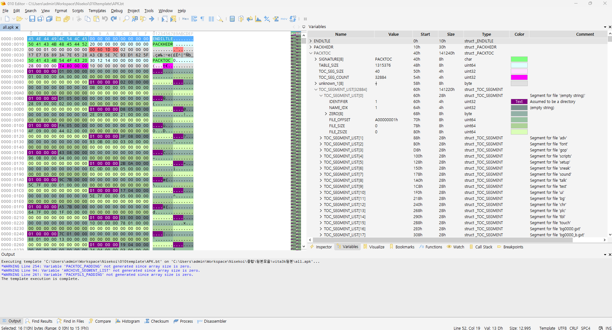
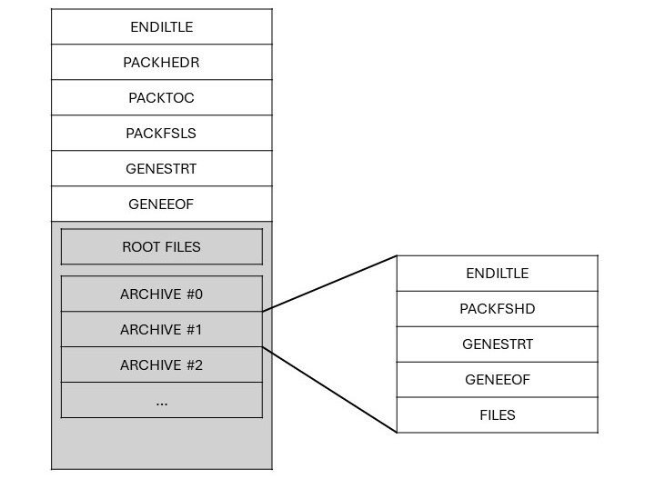
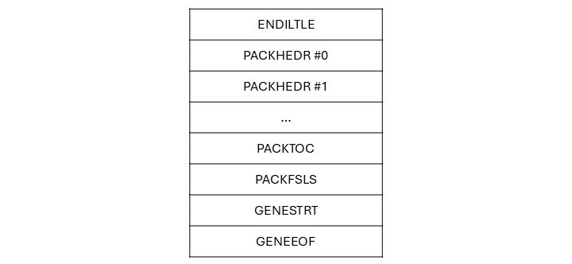

This content was translated by ChatGPT. There may be inaccuracies in grammar, and if you wish, feel free to make natural corrections and submit a PR. I will review and apply it.

---

# Introduction

This is a template for 010 Editor that allows you to easily view the structure of *.apk and *.idx files.

APK and IDX files are formats commonly found in certain console games.

* APK files are archive-format files that contain various files.
* IDX files exist alongside APK files and only contain index information for the files included in the APK.

For a more detailed analysis of the file format, please refer to the [ymtools](https://github.com/akio7624/ymtools) repository.

Additionally, you can use ymtools to edit APK and IDX files in a limited capacity.

# How to Use
1. Download the *.bt files and save them in an appropriate location.
    * The `APK.bt` file is a template specifically for *.apk files.
    * The `IDX.bt` file is a template specifically for *.idx files.
    * The `APK-nolib.bt` file is a template for *.apk files that can be run without DLL libraries.
2. (Windows only) Place the `LibApkIdxTemplate.dll` file in the same folder as the template files.
3. Open the file you want to analyze with 010 Editor.
4. Select the appropriate template file by going to `Templates > Open Template...`.
5. When the template file window opens, press F5 to run the template.
6. In the `Variables` tab, you can easily view the structure of the analyzed file.

# Errors
## Check the file is a valid ??-bit library.
The error `Check the file is a valid ??-bit library.` may occur if the DLL file does not match the architecture of Windows. 
If your computer is 32-bit, use the file from the x86 folder; if it is 64-bit, use the DLL file from the x64 folder.

## Could not locate file to link.
If you encounter the error `Could not locate file to link.`, please check that the DLL file is named `LibApkIdxTemplate.dll`.

Currently, the library only supports Windows, so if you are running it on Linux or similar, please use the `APK-nolib.bt` file instead of `APK.bt`. 
This only affects the feature that displays additional file names; it does not interfere with file analysis.
* The IDX.bt template does not require any additional files to run.

---

Update: 2024-11-01

# Internal Structure of APK Files
I will now provide a detailed explanation of the internal structure of APK files. All information is based on previously analyzed materials and various analyses, and is not official, so it is not guaranteed to be 100% accurate.

The names of each area introduced here are not official terms but are assigned by the author. The structure of this file has never been officially disclosed.

Basically, it is structured as shown in the image above. An APK file is an archive-type file used to store files.

The front part of the file contains information about the offsets, sizes, and names of the contained files, while the actual file data is listed at the back of the file.

There is also the concept of an archive, where each archive can contain files. It’s not an exact analogy, but you can think of it as similar to a folder.

## ENDILTLE Table
|     Name     |  Data Type   | Size | Description                                                                                               |
|:------------:|:------------:|:----:|:----------------------------------------------------------------------------------------------------------|
| ENDIANESS    | char[]       |  8   | If `ENDILTLE`, all fields in the file are read in little-endian.   It is expected that it would be `ENDIBIGE` if big-endian, but such a file has not yet been found. |
|  PADDING     | byte[]       |  8   | Zero padding to ensure the total size of the table is a multiple of 16 bytes.   Since `ENDIANESS` is always 8 characters, the padding is also always 8 bytes. |

## PACKHEDR Table
|        Name         |  Data Type  | Size | Description                                                         |
|:-------------------:|:-----------:|:----:|:-------------------------------------------------------------------|
|    SIGNATURE        | char[]      |  8   | The signature bytes of the table. Always `PACKHEDR`.               |
|    TABLE SIZE       | uint64      |  8   | The size of the table excluding the first 16 bytes.                |
|    unknown 1        |     -       |  8   | Unknown area.   Commonly seen as `00 00 01 00 00 00 00 00` in various files. |
| FILE LIST OFFSET    | uint32      |  4   | The offset where the actual file list begins.                       |
| ARCHIVE PADDING TYPE | uint32 | 4  | Likely used to specify block size for archive padding. `1 (0x0001)`: Padded to be divisible by 2048. `2 (0x0002)`: Padded to be divisible by 512. |
|       HASH          | byte[]      | 16   | Almost certainly the MD5 hash checksum of the file, but it is not yet determined which area it hashes. |

Since the size of the table is divisible by 16, no additional padding is required for the table.

## PACKTOC Table
|        Name         |     Data Type     |     Size      | Description                                                                                       |
|:-------------------:|:-----------------:|:-------------:|:-------------------------------------------------------------------------------------------------|
|    SIGNATURE        |      char[]       |       8       | The signature bytes of the table. Always `PACKTOC `.   Note that there is a space (0x20) at the end. |
|    TABLE SIZE       |      uint64       |       8       | The size of the table excluding the first 16 bytes.                                             |
|   TOC SEG SIZE      |      uint32       |       4       | Size of one `TOC SEGMENT`.   It seems that the structure of this segment is consistent, so the value is expected to be fixed at `40`. |
|  TOC SEG COUNT      |      uint32       |       4       | Total number of `TOC SEGMENT`s.                                                                   |
|    unknown 1        |        -          |       8       | Unknown area.   Commonly seen as `10 00 00 00 00 00 00 00` in various files.                |
| TOC SEGMENT LIST    | TOC_SEGMENT[]     | `TOC SEG COUNT` | Contains `TOC SEGMENT`s, with a count equal to `TOC SEG COUNT`.   The structure of this segment will be explained in the next paragraph. |
|     PADDING         |      byte[]       |       n       | Zero padding to ensure the total size of the table is a multiple of 16 bytes.                     |

### TOC SEGMENT
|     Name      |  Data Type   | Size | Description                                                                                                                                                       |
|:-------------:|:------------:|:----:|:------------------------------------------------------------------------------------------------------------------------------------------------------------------|
| IDENTIFIER    | uint32       |  4   | Indicates the type of the file.   `0 (0x0000)`: File stored uncompressed.   `1 (0x0001)`: Directory.   `512 (0x0200)`: File stored compressed with zlib. |
|  NAME_IDX     | uint32       |  4   | Index in the `FILE NAMES` array of the subsequent `GENESTRT` table.   This index can be used to retrieve the name of the file.                                 |
|    ZERO       | byte[]       |  8   | Area filled with 8 bytes of `0`.   The reason for this is unknown.                                                                                             |
| FILE OFFSET   | uint64       |  8   | Starting point of the actual data for the file represented by the segment.   The offset is relative to the beginning of the file.                              |
|  FILE SIZE    | uint64       |  8   | Size of the uncompressed file (in bytes).   If `IDENTIFIER` is `1`, this value is `0`.                                                                         |
| FILE ZSIZE    | uint64       |  8   | Size of the compressed file (in bytes).   If it is an uncompressed file (`IDENTIFIER` is `0`), this value is `0`.                                              |

The `TOC SEGMENT` is a segment that contains key information about the files included in the APK.

Entries within the same folder are listed consecutively in order.

#### For Directories

|      Name       |   Type   | Size | Description                                                                                       |
|:---------------:|:--------:|:----:|:--------------------------------------------------------------------------------------------------|
| ENTRY INDEX     | uint32   |  4   | Starting index in the `TOC SEGMENT` list for items contained in the folder represented by the current segment. |
| ENTRY COUNT     | uint32   |  4   | Number of items contained in the folder, starting from the segment indicated by `ENTRY INDEX`.   |

When `IDENTIFIER` is `1`, indicating a directory, the bytes corresponding to `FILE_OFFSET` should be interpreted as shown in the table above.

This represents information about folders and files within the current segment.
Specifically, starting from the segment at `ENTRY INDEX` in the `TOC SEGMENT LIST`, `ENTRY COUNT` items are included in the folder.
This implies that entries within the same folder must be listed consecutively.

## PACKFSLS Table
|          Name          |        Data Type        |        Size         | Description                                                                              |
|:---------------------:|:---------------------:|:-----------------:|:--------------------------------------------------------------------------------------|
|      SIGNATURE        |      char[]          |         8         | Signature bytes of the table. Always `PACKFSLS`.                                       |
|      TABLE SIZE       |      uint64          |         8         | Size of the table excluding the first 16 bytes.                                        |
|  ARCHIVE SEG COUNT    |      uint32          |         4         | Total count of `ARCHIVE SEGMENT`.                                                      |
|   ARCHIVE SEG SIZE    |      uint32          |         4         | Size of one `ARCHIVE SEGMENT`. However, it is expected that this segment has a fixed size of `40`. |
|      unknown 1        |         -            |         8         | Unknown area. Commonly found as `10 00 00 00 00 00 00 00` in several files.       |
| ARCHIVE SEGMENT LIST  | ARCHIVE_SEGMENT[]    | `ARCHIVE SEG COUNT` | Lists the `ARCHIVE SEGMENT`, totaling `ARCHIVE SEG COUNT`. The structure of this segment will be explained in the next paragraph. |
|       PADDING         |      byte[]          |         n         | 0 padding to ensure that the total size of the table is a multiple of 16 bytes.       |

### ARCHIVE SEGMENT
|       Name       |  Data Type   | Size | Description                                                                          |
|:---------------:|:------------:|:----:|:----------------------------------------------------------------------------------|
|    NAME IDX     | uint32       | 4    | Index in the `GENESTRT` table’s `FILE NAMES` array for each archive. This index can be used to retrieve the file name. |
|      ZERO       | byte[]      | 4    | Area filled with 4 bytes of `0`. The reason for this structure is unknown.      |
| ARCHIVE OFFSET   | uint64       | 8    | The starting point of where the archive actually resides in the file. The offset is based on the beginning of the file. |
|  ARCHIVE SIZE   | uint64       | 8    | Actual size of the archive excluding padding (in bytes).                          |
|      HASH       | byte[]      | 16   | MD5 hash of the entire archive excluding padding.                                  |

## GENESTRT Table
|              Name              |   Data Type    |         Size         | Description                                                                                                                                                              |
|:------------------------------:|:--------------:|:-------------------:|:------------------------------------------------------------------------------------------------------------------------------------------------------------------------|
|          SIGNATURE             |  char[]        |         8           | Signature bytes of the table. Always `GENESTRT`.                                                                                                                                   |
|         TABLE SIZE 1           |  uint64        |         8           | Size of the table excluding the first 16 bytes.                                                                                                                                  |
|        FILENAME COUNT          |  uint32        |         4           | The number of file names, which includes the entries in the `FILENAME OFFSET LIST` and `FILE NAMES`.                                                                            |
|          unknown 1             |      -         |         4           | Unknown area. Commonly found as `10 00 00 00` in several files.                                                                                                           |
|      FILE NAMES OFFSET         |  uint32        |         4           | Relative offset from the table header to the start of `FILE NAMES`. Simply put, this is the difference between the last offset of `FILENAME OFFSET LIST PADDING` and the starting offset of `FILENAME COUNT`. |
|         TABLE SIZE 2           |  uint32        |         4           | Estimated to be the same value as `TABLE SIZE 1`. The reason for this field's existence is unknown.                                                                        |
|     FILENAME OFFSET LIST       | uint32[]       | `FILENAME COUNT`    | Offsets of each string (file name) relative to the start of `FILE NAMES`.                                                                                                     |
| FILENAME OFFSET LIST PADDING   |  byte[]        |         n           | 0 padding to ensure that the size of `FILENAME OFFSET LIST` is a multiple of 16 bytes.                                                                                          |
|          FILE NAMES            | string[]       | `FILENAME COUNT`    | Each file name is listed as null-terminated strings.                                                                                                                            |
|       GENESTRT PADDING         |  byte[]        |         n           | 0 padding to ensure that the total size of the table is a multiple of 16 bytes.                                                                                              |

## GENEEOF Table
|        Name         |  Data Type   | Size | Description                                                                                |
|:------------------:|:------------:|:----:|:------------------------------------------------------------------------------------------|
|     SIGNATURE      | char[]       | 8    | Signature bytes of the table. Always `GENEEOF`. Note that a space (0x20) exists at the end.  |
|      PADDING       | byte[]       | 8    | 0 padding to ensure that the total size of the table is a multiple of 16 bytes. Since `SIGNATURE` is always 8 characters, the padding is also always 8 bytes. |
| TABLE END PADDING  | byte[]       | n    | It is assumed that padding is applied so that the total size from the beginning of the file, including `TABLE END PADDING`, is divisible by `2048`. This block size is independent of the `ARCHIVE PADDING TYPE` in `PACKHEDR`. |

## ROOT Files and Archive Area

### Listing of ROOT Files
The actual files are listed starting after the `TABLE END PADDING`. These files are stored either compressed or uncompressed, depending on the `IDENTIFIER` of the `TOC SEGMENT`.

The term ROOT file is used to distinguish it from files included in the archive.

It's important to note that it's not just a matter of listing the file contents; padding must also be added for each file. For convenience, let's refer to the combination of the file data and padding as a file block.

The size of the padding can be calculated using the following method:

* If the file size (in bytes) is a multiple of 512:
  * The file size is the block size.
  * The file is stored as is, without padding.
* In other cases:
  * The smallest size that can accommodate the file is the value of $(512 \times n) - 1$.
  * The difference between the calculated block size and the actual file size is padded with `0`s at the end of the file.

Let's take an example. Assume the size of the file to be added is 2752 bytes.

* $(512 \times 5) - 1 = 2559$. This size is too small to hold the file.
* $(512 \times 6) - 1 = 3071$. This size can hold the file.
* $(512 \times 7) - 1 = 3583$. This size can hold the file, but since the smaller value of 3071 exists, there's no need to calculate further.

The block size is determined to be 3071 bytes. The padding size becomes $3071 - 2752 = 319$ bytes. After adding this file, it will be padded with 319 bytes of `0`s at the end, and then the next file will be listed in the same manner.

### Padding for Entire ROOT Files (ROOT FILES PADDING)

If there are ROOT files listed, followed by archives, padding must be added between the ROOT files and the archives.

This padding is assumed to be applied so that the combined size of all ROOT files and any existing padding is divisible by 2048.

If only ROOT files are listed and the file ends, or if there are no ROOT files at all (specifically, when the SIZE of all ROOT files is 0), padding may not be necessary. In some cases, even when ROOT files exist but have a size of 0, no padding is added.

### Listing of Archives and Structure of Archives
Once all ROOT files are listed, it's time to list the archives. If the value of `ARCHIVE SEG SIZE` in the `PACKFSLS` table is 0, it means that archives are not included, so this step can be skipped.

If there are no archives, the last ROOT file block will be listed, and the file will end there.

If archives exist, they can be simply listed. Think of archives as a type of ROOT file (although they are not just simple files). Additionally, if you think of the name of the archive as a folder when unpacking an APK file, with the files contained in the archive stored inside that folder, it will be easier to understand.

Archives can contain files themselves, so there is a table that stores the information of each file. There are tables that have already been mentioned and some that are used only within archives.

One important point is that the offsets for files stored in the archive are relative offsets based on the location where the archive is listed, not based on the beginning of the APK file.

#### ENDILTLE Table
|     Name     |  Type   | Size | Description                                                                                                 |
|:----------:|:------:|:--:|:-----------------------------------------------------------------------------------------------------------|
| ENDIANESS  | char[] | 8  | If it's `ENDILTLE`, all fields in the archive are read as little-endian. For big-endian, it is expected to be `ENDIBIGE`, but no such archive has been found so far. |
|  PADDING   | byte[] | 8  | Zero padding to ensure that the total size of the table is divisible by 16 bytes. Since `ENDIANESS` is always 8 characters, the padding is also always 8 bytes. |

This is the same as the `ENDILTLE` table mentioned above.

#### PACKFSHD Table
|       Name        |          Type           |       Size       | Description                                                                                  |
|:---------------:|:----------------------:|:--------------:|:------------------------------------------------------------------------------------------|
|    SIGNATURE    |         char[]         |       8        | The signature bytes of the table. Always `PACKFSHD`.                                                     |
|   TABLE SIZE    |         uint64         |       8        | The size of the table excluding the first 16 bytes of the table.                                      |
|    unknown 1    |           -            |       4        | Unknown area. Commonly observed as `00 00 01 00` in multiple files.                                      |
|  FILE SEG SIZE  |         uint32         |       4        | The size of one `ARCHIVE FILE SEGMENT`. However, it seems that the structure of this segment is constant, so the value is expected to be fixed at `32`. |
| FILE SEG COUNT  |         uint32         |       4        | The total number of `ARCHIVE FILE SEGMENT`.                                                   |
| FILE SEG SIZE 2 |         uint32         |       4        | Presumed to be the same value as `FILE SEG SIZE`. The reason for the existence of this field is unknown.                          |
|    unknown 2    |         uint32         |       4        | A value that is divisible by 32. Its meaning is unclear. This value tends to increase as `FILE SEG COUNT` increases.                     |
|    unknown 3    |           -            |       12       | Unknown area. Commonly observed as `00 00 00 00 00 00 00 00 00 00 00 00` in multiple files.                  |
|  FILE SEG LIST  | ARCHIVE_FILE_SEGMENT[] | FILE SEG COUNT | Contains `ARCHIVE FILE SEGMENT` equal to `FILE SEG COUNT`. The structure of this segment will be explained in the next paragraph.      |
|     PADDING     |         byte[]         |       n        | Zero padding to ensure that the total size of the table is divisible by 16 bytes.                      |

This is similar to the `PACKTOC` table mentioned above.

##### ARCHIVE FILE SEGMENT
|     Name      |  Type   | Size | Description                                                                                         |
|:-----------:|:------:|:--:|:-----------------------------------------------------------------------------------------------|
|  NAME_IDX   | uint32 | 4  | The index of the `FILE NAMES` array in the `GENESTRT` table of the upcoming archive. File names can be retrieved using this index.            |
|     ZIP     | uint32 | 4  | A value indicating the type of the file. `0 (0x0000)`: File stored without compression. `2 (0x0002)`: File stored compressed with zlib. |
| FILE OFFSET | uint64 | 8  | The starting point of the actual location of the data represented by the segment. The offset is based on the **beginning of the archive**.                  |
|  FILE SIZE  | uint64 | 8  | The uncompressed size of the file (in bytes). If `ZIP` is `2`, this value is `0`.                                   |
| FILE ZSIZE  | uint64 | 8  | The size of the file in its compressed state (in bytes). If the file is uncompressed (`ZIP` is `0`), this value is `0`.                       |

`ARCHIVE FILE SEGMENT` is a segment that contains the main information of the files included in the archive.

#### GENESTRT Table
|              Name              |   Type    |         Size         | Description                                                                                                                                                            |
|:----------------------------:|:--------:|:------------------:|:--------------------------------------------------------------------------------------------------------------------------------------------------------------------|
|          SIGNATURE           |  char[]  |         8          | The signature bytes of the table. Always `GENESTRT`.                                                                                                                                   |
|         TABLE SIZE 1         |  uint64  |         8          | The size of the table excluding the first 16 bytes.                                                                                                                                         |
|        FILENAME COUNT        |  uint32  |         4          | The number of file names, which is the count of items contained in `FILENAME OFFSET LIST` and `FILE NAMES`.                                                                                                 |
|          unknown 1           |    -     |         4          | Unknown area. Commonly observed as `10 00 00 00` in multiple files.                                                                                                                                   |
|      FILE NAMES OFFSET       |  uint32  |         4          | A relative offset indicating where `FILE NAMES` starts, based on the header of the table (offset after `STR OFFSET COUNT`). In simple terms, it is the difference between the last offset of `FILENAME OFFSET LIST PADDING` and the starting offset of `FILENAME COUNT`. |
|         TABLE SIZE 2         |  uint32  |         4          | Presumed to be the same value as `TABLE SIZE 1`. The reason for the existence of this field is unknown.                                                                                                               |
|     FILENAME OFFSET LIST     | uint32[] | `FILENAME COUNT` | An array of offsets for each string (file name) based on the starting point of the `FILE NAMES` area.                                                                                                        |
| FILENAME OFFSET LIST PADDING |  byte[]  |         n          | Zero padding to ensure that the size of `FILENAME OFFSET LIST` is divisible by 16 bytes.                                                                                                                  |
|          FILE NAMES          | string[] | `FILENAME COUNT` | A list of null-terminated strings for each file name.                                                                                                                                  |
|       GENESTRT PADDING       |  byte[]  |         n          | Zero padding to ensure that the total size of the table is divisible by 16 bytes.                                                                                                                                     |

This is the same as the `GENESTRT` table mentioned above.

### GENEEOF Table
|        Name         |  Type   | Size | Description                                                                                |
|:-----------------:|:------:|:--:|:----------------------------------------------------------------------------------------|
|     SIGNATURE     | char[] | 8  | The signature bytes of the table. Always `GENEEOF`. Note that a space (0x20) exists at the end.                         |
|      PADDING      | byte[] | 8  | Zero padding to ensure that the total size of the table is divisible by 16 bytes. Since `SIGNATURE` is always 8 characters, the padding is also always 8 bytes. |

This is the same as the `GENESTRT` table mentioned above, except that there is no `TABLE END PADDING`.

### Listing of Archive Files

Like the ROOT file, the files included in the archive are also listed.  
However, the padding method is slightly different.

Padding is added so that the size of the file blocks is divisible by 16, similar to how tables are padded.

* If the file size is a multiple of 16:
  * The file size is the block size.
  * The file is saved as-is without padding.
* Otherwise:
  * The smallest amount of padding is added at the end of the file to make the sum of the file and the padding a multiple of 16.

In other words, there may be no padding at all or a maximum of 15 bytes of padding.  
Naturally, it is padded with `0`s.

### Archive Padding

This part is also important.
The archive itself also requires padding.

The padding size varies depending on the `ARCHIVE PADDING TYPE` in `PACKHEDR`.
* If `ARCHIVE PADDING TYPE` is `1`, the block size for padding is calculated as $(2048 \times n) - 1$.
* If `ARCHIVE PADDING TYPE` is `2`, the block size for padding is calculated as $(512 \times n) - 1$ (the same padding method used for ROOT files).

The important point is that if there are more archives following, padding should be applied; however, if the current archive is the last one, **no padding is applied**.

Keep this in mind when processing all the archives to complete the APK file.

# Internal Structure of IDX Files

Now, I will explain the internal structure of IDX files in detail. Once again, all information has been revealed through the analysis of some materials and various analyses, and since it is not official, it cannot be 100% guaranteed.

The names of the areas introduced here are all arbitrary designations by the author and are not official names. The structure of this file has never been officially disclosed.

The IDX file can be viewed as a type of index file.  
This file contains information about the files stored in the game's APK file but does not include the actual file contents.

Since the IDX file is created in conjunction with the accompanying APK file, any modifications to offset values, etc., in the APK file must also be reflected in the IDX file to prevent errors during game execution.

The important point is that all files indexed here are either ROOT files or the archive itself.  
Files included within the archive are not included in the IDX file.

Fortunately, the IDX file has a format that is almost identical to that of the APK file.  
The contents of the tables are essentially the same as in the APK file, with only slight differences in the composition of the tables.  
Now, let’s take a look at the internal structure of the IDX file.

## ENDILTLE Table
|     Name      |  Type   | Size | Description                                                                                          |
|:------------:|:------:|:--:|:----------------------------------------------------------------------------------------------------|
| ENDIANESS    | char[] | 8  | If `ENDILTLE`, all fields in the file are read as little-endian. If big-endian, it is expected to be `ENDIBIGE`, but no such file has been found so far. |
| PADDING       | byte[] | 8  | Zero padding to ensure that the total size of the table is divisible by 16 bytes. Since `ENDIANESS` is always 8 characters, the padding is also always 8 bytes. |

This is identical to the `ENDILTLE` table in the APK file.

## PACKHEDR Table List
|        Name        |  Type   | Size | Description                                                              |
|:-----------------:|:------:|:--:|:------------------------------------------------------------------------|
|    SIGNATURE      | char[] | 8  | The signature bytes of the table. Always `PACKHEDR`.                                   |
|    TABLE SIZE     | uint64 | 8  | The size of the table excluding the first 16 bytes.                                |
|    unknown 1      |   -    | 8  | An unknown area. Several files commonly show `00 00 01 00 00 00 00 00`.      |
| FILE LIST OFFSET   | uint32 | 4  | The offset where the actual file listing begins.                                  |
| ARCHIVE PADDING TYPE | uint32 | 4  | Likely used to specify block size for archive padding. `1 (0x0001)`: Padded to be divisible by 2048. `2 (0x0002)`: Padded to be divisible by 512. |
|       HASH        | byte[] | 16 | It is almost certain that this is the MD5 hash checksum of the file, but it is still unclear which area is being hashed. |

The structure of this table is the same as the `PACKHEDR` table in the APK file.

However, in the IDX file, this table is listed.  
If the IDX file indexes two files, `a.apk` and `b.apk`, then the `PACKHEDR` tables of both files are listed.

You can think of it as a structure where the `PACKHEDR` tables of each APK file are directly copied and listed.

## PACKTOC Table
|        Name        |      Type      |      Size       | Description                                                                          |
|:-----------------:|:-------------:|:-------------:|:----------------------------------------------------------------------------------|
|    SIGNATURE      |    char[]     |       8       | The signature bytes of the table. Always `PACKTOC`. Note that a space (0x20) exists at the end.            |
|    TABLE SIZE     |    uint64     |       8       | The size of the table excluding the first 16 bytes.                                                  |
|   TOC SEG SIZE    |    uint32     |       4       | The size of a single `TOC SEGMENT`. However, since the structure of this segment seems fixed, it is expected that the value will be `40`. |
|  TOC SEG COUNT    |    uint32     |       4       | The total number of `TOC SEGMENT`s.                                                  |
|    unknown 1      |       -       |       8       | An unknown area. Several files commonly show `10 00 00 00 00 00 00 00`.                  |
| TOC SEGMENT LIST  | TOC_SEGMENT[] | `TOC SEG COUNT` | `TOC SEGMENT`s are listed according to `TOC SEG COUNT`. The structure of this segment will be explained in the next section.                    |
|     PADDING       |    byte[]     |       n       | Zero padding to ensure that the total size of the table is divisible by 16 bytes.                                      |

The structure of this table is the same as the `PACKTOC` table in the APK file.

### TOC SEGMENT
|     Name      |  Type   | Size | Description                                                                                                                 |
|:-----------:|:------:|:--:|:---------------------------------------------------------------------------------------------------------------------------|
| IDENTIFIER  | uint32 | 4  | A value that indicates the type of the file. `0 (0x0000)`: A file stored uncompressed. `1 (0x0001)`: Presumably a folder. `512 (0x0200)`: A file stored compressed with zlib. |
|  NAME_IDX   | uint32 | 4  | An index for the `FILE NAMES` array in the subsequent `GENESTRT` table. This index can be used to retrieve the name of the file.                            |
|    ZERO     | byte[] | 8  | An area filled with `0` bytes of length 8. The reason for this is unknown.                                                              |
| FILE OFFSET | uint64 | 8  | The starting point where the data represented by the segment is located. The offset is based on the beginning of the file.                                          |
|  FILE SIZE  | uint64 | 8  | The uncompressed size of the file (in bytes). If `IDENTIFIER` is `1`, this will be `0`.                                            |
| FILE ZSIZE  | uint64 | 8  | The size of the file in its compressed state (in bytes). If the file is uncompressed (`IDENTIFIER` is `0`), this will be `0`.                                            |

The structure of this segment is the same as the `TOC SEGMENT` in the APK file.

## PACKFSLS Table

|          Name          |        Type        |        Size         | Description                                                                           |
|:----------------------:|:------------------:|:-------------------:|:-------------------------------------------------------------------------------------|
|      SIGNATURE         |      char[]        |         8           | The signature bytes of the table. Always `PACKFSLS`.                                |
|      TABLE SIZE        |      uint64        |         8           | The size of the table excluding the first 16 bytes.                                 |
|  ARCHIVE SEG COUNT     |      uint32        |         4           | The total number of `ARCHIVE SEGMENT`s.                                            |
|   ARCHIVE SEG SIZE     |      uint32        |         4           | The size of one `ARCHIVE SEGMENT`. This segment's structure seems fixed, so the value is expected to be `40`. |
|      unknown 1         |         -          |         8           | Unknown area. It appears that `10 00 00 00 00 00 00 00` is common across several files. |
| ARCHIVE SEGMENT LIST   | ARCHIVE_SEGMENT[]  | `ARCHIVE SEG COUNT` | The `ARCHIVE SEGMENT`s are listed in the count specified. The structure of this segment is described in the following paragraph. |
|       PADDING          |      byte[]        |         n           | 0 padding to ensure the total size of the table is divisible by 16 bytes.          |

The structure is identical to the `PACKFSLS` in the apk file.

### ARCHIVE SEGMENT

|       Name       |  Type   | Size | Description                                                                         |
|:----------------:|:-------:|:-----|:-----------------------------------------------------------------------------------|
|    NAME IDX      | uint32  |  4   | An index of the `FILE NAMES` array in the `GENESTRT` table included in each archive. This index can be used to retrieve the file name. |
|      ZERO        | byte[]  |  4   | An area filled with 4 bytes of `0`. The reason for this is unknown.              |
| ARCHIVE OFFSET    | uint64  |  8   | The starting point of the area where the archive is actually located in the file. The offset is relative to the beginning of the file. |
|  ARCHIVE SIZE    | uint64  |  8   | The actual size of the archive (in bytes) excluding padding.                     |
|      HASH        | byte[]  |  16  | The MD5 hash value of the entire archive excluding padding.                       |

The structure is identical to the `ARCHIVE SEGMENT` in the apk file.

## GENESTRT Table
|        Name         |   Type    |    Size    | Description                                                                                                                            |
|:-------------------:|:---------:|:----------:|:---------------------------------------------------------------------------------------------------------------------------------------|
|      SIGNATURE      |  char[]   |      8     | Signature bytes of the table. Always `GENESTRT`.                                                                                       |
|    TABLE SIZE 1     |  uint64   |      8     | Size of the table excluding the first 16 bytes.                                                                                        |
|   FILENAME COUNT    |  uint32   |      4     | Number of file names, representing the number of entries in `FILENAME OFFSET LIST` and `FILE NAMES`.                                   |
|      unknown 1      |     -     |      4     | Unknown field. `10 00 00 00` is commonly seen across multiple files.                                                                   |
|  FILE NAMES OFFSET  |  uint32   |      4     | Relative offset where `FILE NAMES` starts, based on the beginning of `STR OFFSET COUNT`. Simply put, it’s the last offset in `FILENAME OFFSET LIST PADDING` minus the starting offset of `FILENAME COUNT`. |
|    TABLE SIZE 2     |  uint32   |      4     | Presumably the same value as `TABLE SIZE 1`. The purpose of this field is unknown.                                                  |
| FILENAME OFFSET LIST | uint32[] | `FILENAME COUNT` | Offsets for each string (file name), relative to the start of `FILE NAMES`.                                                            |
|FILENAME OFFSET LIST PADDING | byte[] |      n     | Zero padding to make the size of `FILENAME OFFSET LIST` a multiple of 16 bytes.                                                        |
|     FILE NAMES      | string[] | `FILENAME COUNT` | List of file names as null-terminated strings.                                                                                         |
|    GENESTRT PADDING |  byte[]  |      n     | Zero padding to make the total table size a multiple of 16 bytes.                                                                      |

The structure is the same as the `GENESTRT` table in the APK file.

## GENEEOF Table
|      Name      |  Type   | Size | Description                                                                                                   |
|:--------------:|:-------:|:----:|:--------------------------------------------------------------------------------------------------------------|
|   SIGNATURE    | char[]  |  8   | Signature bytes of the table. Always `GENEEOF `. Note the space (0x20) at the end.                            |
|    PADDING     | byte[]  |  8   | Zero padding to make the table size a multiple of 16 bytes. Since `SIGNATURE` is always 8 characters, the padding is always 8 bytes as well. |

Except for the lack of final padding, the structure is the same as the `GENEEOF` table in the APK file.